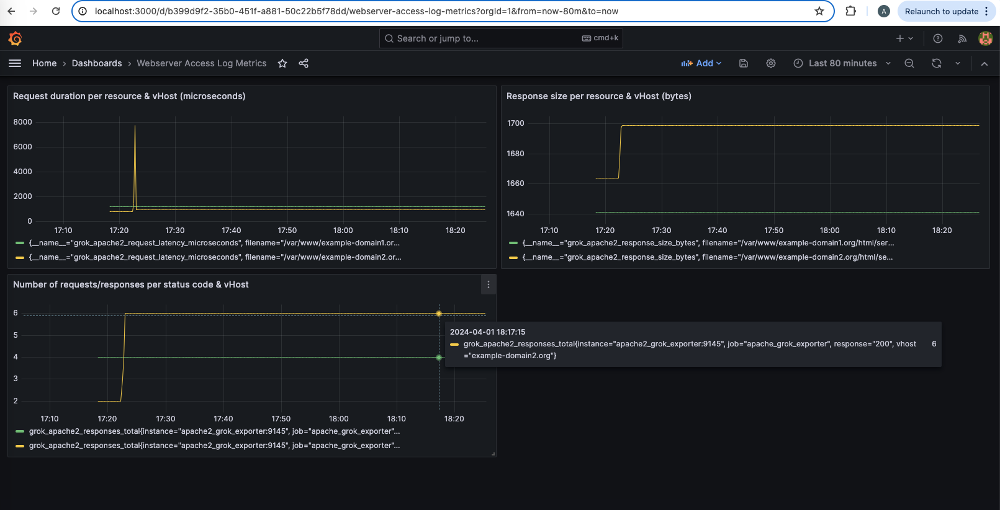

# Webserver (apache2) access log metrics with Prometheus

Wie gefordert (Aufgabe "3a"), skizziere ich hier eine Lösung, wie Kennzahlen (Metriken) aus [Apache2](https://httpd.apache.org/) Access Log Dateien mithilfe folgender Open source Werkzeuge extrahiert und visualisiert werden können:

- [grok_exporter](https://github.com/sysdiglabs/grok_exporter)
- [Prometheus](https://prometheus.io/)
- [Grafana](https://grafana.com/grafana/)

Dabei ist zu beachten, das die dargestellte Lösung als Prototyp zu verstehen ist und keinesfalls in dieser Form produktiv eingesetzt werden sollte.

Auf Basis der verwendeten Werkzeuge lässt sich dann dieses beispielhafte _Grafana Dashboard_ erstellen (**nicht** Teil des Git Repository!):



## Wie kann die Lösung lokal ausprobiert weden?

Die prototypische Lösung kann unter auf Linux-System mit Docker folgendermaßen ausgeführt werden:
```
$ git clone https://github.com/asemt/chemm.git
$ cd chemm
$ docker compose up # alternativ: docker-compose up 
```

Dann ist die Datei `/etc/hosts` anzupassen, so dass die beispielhaft im Apache2 Webserver konfigurierten Domains bzw. Virtual Hosts `example-domain1.org` und `example-domain2.org` auflösbar sind:
```
127.0.0.1 example-domain1.org
127.0.0.1 example-domain2.org
```

Danach kann dann durch aufrufen der Apache2 Server-Status URLs für [example-domain1.org](http://example-domain1.org:8080/server-status) sowie [example-domain2.org](http://example-domain2.org:8080/server-status) Web-Traffic erzeugt werden, aus denen dann wiederum die Metriken extrahiert werden können. 

Anschließend kann durch den [Login in Grafana](http://localhost:3000/login) (Benutzername `admin` und Passwort `grafana`) Prometheus als Datenquelle konfiguriert (`Prometheus server URL`: `http://prometheus:9090`) und Metrik-Abfragen wie [hier beschrieben](https://prometheus.io/docs/visualization/grafana/) angelegt werden. Dabei stehen folgende aus den Apacha2 Access Log-Dateien extrahierte Metriken zur Verfügung (diese sind in der Datei `grok_exporter_config.yml` definiert), jeweils nach Virtual Host (_vhost_) getrennt aufgeführt (symbolisiert durch die beiden unterschiedlichen Farben im obigen Dashboard Sreenshot):

- `grok_apache2_responses_total`
- `grok_apache2_request_latency_microseconds`
- `grok_apache2_response_size_bytes`


Fragen zur vorgestellen Lösung beantworte ich gern im persönlichen Gespräch.
